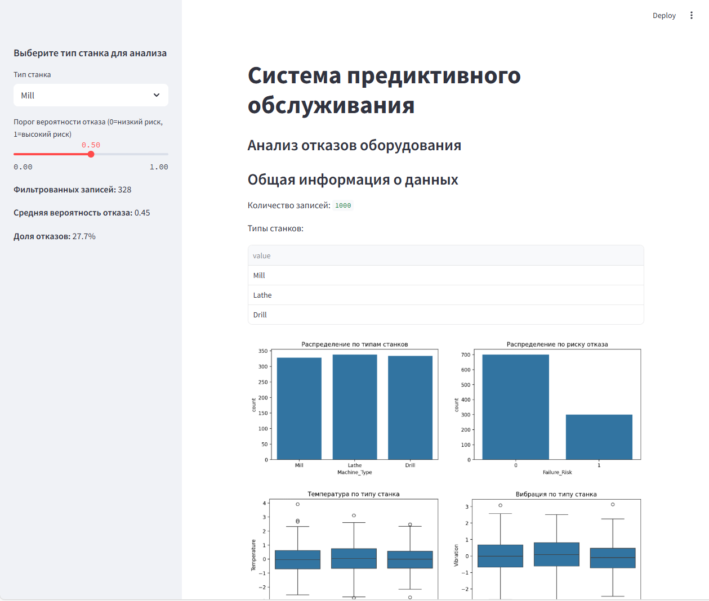
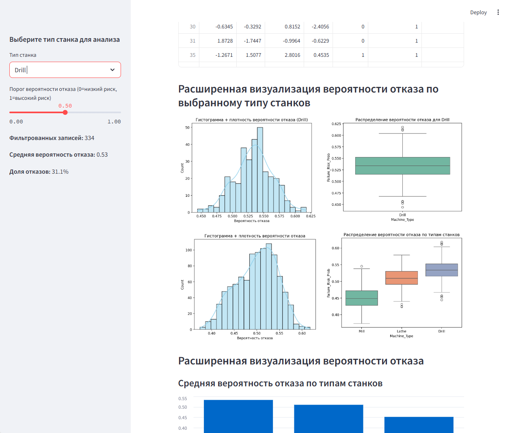
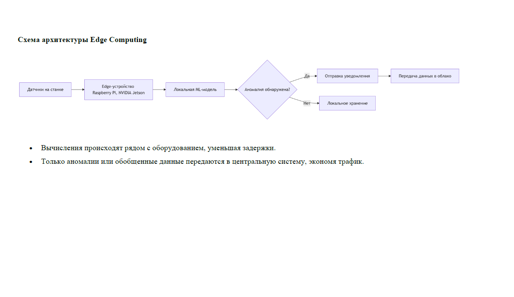

# Predictive Maintenance System for Industrial Equipment

## Full ML Pipeline · Data Engineering · Edge/Cloud Architecture · Streamlit App

Этот репозиторий содержит **полноценный дипломный проект**, разработанный в рамках программы _«Разработчик – Аналитик – Data Engineer» (GeekBrains, 2025)_.  
Система представляет собой **готовое к внедрению решение предиктивного обслуживания промышленного оборудования**, использующее сенсорные данные, методы машинного обучения и архитектуру Edge Computing.

---

# 1. Executive Summary

В современных условиях высококонкурентного производства эффективность работы промышленного оборудования становится критическим фактором успеха предприятия. Незапланированные простои и аварийные отказы оборудования приводят к существенным экономическим потерям, нарушению производственных графиков и снижению качества продукции. Традиционные подходы к обслуживанию оборудования, такие как планово-предупредительные ремонты или реактивное обслуживание, часто оказываются недостаточно эффективными в условиях современного промышленного производства.

Современное промышленное оборудование оснащено большим количеством сенсоров, но традиционные методы диагностики не успевают реагировать на быстрые изменения параметров и скрытые аномалии.

Проект представляет собой комплексное исследование и разработку интеллектуальной системы, способной прогнозировать возможные отказы оборудования до их фактического наступления. В основе проекта лежит использование современных технологий машинного обучения для анализа данных с промышленных датчиков с целью выявления паттернов, предшествующих сбоям в работе оборудования.

Данная система позволяет:

- _анализировать многопараметрические сенсорные данные_
- _выявлять риск отказа оборудования заранее_
- _предотвращать незапланированные простои_
- _принимать решения на основе данных, а не интуиции_
- _внедрять предиктивный подход вместо реактивного_

Итоговая модель проходит полный ML-пайплайн и достигает высоких показателей качества (см. раздел с метриками).

---

# 2. System Overview

Проект реализует архитектуру, повторяющую реальные промышленные сценарии:

### **Edge уровень**

- Локальный сбор сенсорных данных
- Фильтрация и первичная агрегация
- Отправка пакетов данных в облачный контур

### **Cloud / ML уровень**

- Хранение данных
- Подготовка датасета
- Обучение моделей
- Оценка качества
- Интерпретация признаков
- Деплой ML-модели в виде Streamlit приложения

Архитектурная схема приведена в дипломной работе (Приложение 7).

---

# 3. Machine Learning Pipeline

#### Этапы пайплайна:

✔ Загрузка и объединение датасетов  
✔ Очистка данных, удаление аномалий  
✔ Работа с пропусками  
✔ Масштабирование признаков  
✔ Инженерия признаков (feature engineering):

- отклонения (`Temp_deviation`)
- rolling-features
- градиенты изменений
- признаки риска  
  ✔ Разделение данных на train/test  
  ✔ Обучение нескольких моделей  
  ✔ GridSearch + сравнение параметров  
  ✔ Экспорт лучших моделей

#### **Модели**

- RandomForestClassifier
- XGBoostClassifier
- GradientBoostingClassifier
- LogisticRegression

#### **Метрики**

- **ROC-AUC**
- **Accuracy**
- **Precision / Recall**
- Confusion Matrix
- Importance Scores

Все сравнения сохранены в:

model_comparison_results.csv

---

# 4. Визуализация и исследование данных

В директории `/figures` содержатся:

- Графики распределений признаков
- Корреляции
- Feature Importance
- Сравнение моделей
- ROC-кривые
- Анализ отказов по типам оборудования

Эти материалы демонстрируют глубину проработки данных и качество решений.

---

# 5. Структура проекта

```
sensor-ml-failure-prediction/
│
├── artifacts/ # Артефакты ML
│ ├── best_model.pkl
│ ├── best_rf_model.pkl
│ ├── failure_prediction_model.pkl
│ ├── feature_scaler.pkl
│ ├── model_features.joblib
│ ├── model_features.pkl
│ ├── model_report.txt
│ └── scaler.joblib
│
├── data/
│ ├── processed/ # Подготовленные данные после ETL
│ │ ├── cleaned_machine_failure_data.csv
│ │ ├── feature_importance.csv
│ │ ├── model_comparison_results.csv
│ │ ├── processed_full_dataset.csv
│ │ ├── X_test.csv
│ │ ├── X_train.csv
│ │ ├── y_test.csv
│ │ └── y_train.csv
│ |
│ └── raw/ # Исходные сырые данные
│ └── machine_failure_dataset.csv
│
├── docs/ # Архитектура проекта и сопроводительные материалы
│ ├── architecture.png # Схема архитектуры Edge/Cloud
│ └── diploma.pdf # Официальная дипломная работа
│
├── figures/ # Визуализации исследования
│
├── notebooks/
│ └── machine_failure_code.ipynb # Полный ML-pipeline
│
├── src/
│ └── save_artifacts.py
│
├── dashboard.py # Streamlit-интерфейс
├── requirements.txt
└── README.md
```

---

# 6. Streamlit Dashboard

Интерактивное веб-приложение реализовано на основе **Streamlit**. Предназначено для визуального анализа состояния оборудования, работы предиктивной модели и изучения влияния параметров на риск отказа.

Dashboard использует сохранённые артефакты:

- обученную ML-модель (`failure_prediction_model.pkl`)
- масштабировщик признаков (`feature_scaler.pkl`)
- список признаков модели (`model_features.pkl`)
- подготовленный датасет (`processed_full_dataset.csv`)

### Основные функции дашборда

#### 🔹 1. Подгрузка модели и данных

При запуске приложение:

- загружает ML-артефакты,
- стандартизирует признаки,
- рассчитывает вероятность отказа (`Failure_Risk_Prob`) для каждого наблюдения.

#### 🔹 2. Базовый обзор данных

Отображаются:

- количество записей,
- уникальные типы оборудования,
- распределение оборудования по типам,
- распределение реальных отказов (`Failure_Risk`).

#### 🔹 3. Гибкая фильтрация и анализ по типу оборудования

Пользователь может:

- выбрать конкретный тип оборудования,
- настроить порог риска отказа,
- увидеть список объектов, превышающих порог,
- отобразить средние значения и доли отказов.

#### 🔹 4. Визуальная аналитика

Dashboard содержит большое количество графиков:

- CountPlot распределений
- BoxPlot температур, вибрации, энергопотребления
- Гистограммы + KDE вероятности отказа
- BarPlot статистики отказов
- Кластеризация (KMeans на PCA)
- PCA-визуализация (2-компонентная проекция)
- Корреляционная матрица признаков (Heatmap)

Каждый график автоматически перестраивается при изменении выбранного типа оборудования и порога риска.

#### 🔹 5. Метрики качества модели

Для выбранного поднабора данных рассчитываются:

- Accuracy
- Precision
- Recall
- F1-Score
- ROC-кривая и AUC

Это позволяет пользователю оценить поведение модели на конкретной группе оборудования.

#### 🔹 6. Экспорт данных

Приложение позволяет скачать:

- отфильтрованные записи
- или любые пользовательские выборки

С применением стилизованной кнопки Streamlit.

---

### Запуск дашборда

```bash
streamlit run dashboard.py
```

### Скриншот интерфейса




# 7. Deployment & MLOps

Данный проект следует практикам ML Ops, обеспечивая воспроизводимость, разделение сред, стабильное хранение артефактов и возможность упрощённого деплоя.

### 7.1. Pipeline Execution Workflow

Основной ML-пайплайн реализован в:
machine_failure_code.ipynb

Этапы:

- загрузка и очистка данных (`data/raw/`)
- нормализация и предобработка
- инженерия признаков (отклонения, статистики, PCA)
- обучение нескольких моделей (RF, XGB, Logistic Regression)
- сравнение метрик и выбор лучшей модели
- экспорт артефактов в `/artifacts/`

Все сущности, необходимые для инференса, хранятся централизованно.
Артефакты загружаются в дашборде и обеспечивают стабильный инференс без повторного обучения.

### 7.2. Environment Setup (Python)

Используется Python 3.10+.

Установка зависимостей:

```bash
pip install -r requirements.txt
```

Файл requirements.txt включает только реально используемые библиотеки, полученные с помощью pipreqs, а не полный список global environment.

### 7.3. Reproducibility

Для воспроизводимости экспериментов проект обеспечивает:

- Хранение артефактов

Модель, scaler и признаки сохранены в стабильном виде.

- Фиксацию зависимостей

requirements.txt → замороженные версии всех технологий.

- Консистентный pipeline

Notebook включает все этапы:

EDA
Feature Engineering
PCA
Моделирование
Оценка
Экспорт

- Отдельное приложение для инференса

Дашборд не выполняет перерасчёт подготовки данных — только инференс.

### 7.4. Edge/Cloud Deployment Model

Система разработана с учётом промышленной архитектуры:

#### Edge уровень

- получение данных с сенсорных модулей

- локальный контроль качества сигнала

- первичная фильтрация

- буферизация и отправка батчей

#### Cloud/Server уровень

- хранилище данных (raw + processed)

- исследовательский ML pipeline (notebook)

- автоматическое формирование артефактов

- Streamlit dashboard как интерфейс аналитики

Диаграмма системы:



### 7.5. Production-ready

По архитектуре проект допускает:

- деплой модели в виде REST API (FastAPI / Flask)

- контейнеризацию (Docker)

- развёртывание в облаке (AWS / GCP / Azure / Yandex Cloud)

- запуск дашборда в Docker-контейнере

- периодическое обновление модели (MLOps workflow)

В текущей версии основной акцент сделан на:

- прозрачный pipeline,

- стабильные артефакты,

- визуальный ML-интерфейс,

- структурированную архитектуру Edge → Cloud.

Проект включает элементы, необходимые для промышленного внедрения:

- раздельные слои данных

- чистая ML-архитектура

- отсутствие обучения “в онлайне”

- стабильные артефакты

- стандартизированное предобработанное пространство признаков

- модульная структура кода

- дашборд, который может служить инструментом диагностики

### 8. Business Value

Система может быть внедрена в:

- машиностроение

- химическую промышленность

- энергетическое оборудование

- HVAC-системы

- производственные линии

Предоставляет:

- Конкретные выгоды

- снижение количества аварий на 20–40%

- уменьшение незапланированных простоев

- повышение эффективности ТО

- точную оценку состояния оборудования

- раннее предупреждение об аномалиях

### 9. Материалы дипломной работы

Проект является реализацией дипломной работы:

**«Разработка системы предиктивного обслуживания промышленного оборудования на основе анализа сенсорных данных и методов машинного обучения»**
Программа: Разработчик — Аналитик — Data Engineer
GeekBrains, 2025

В репозитории присутствуют:

- полный ML-пайплайн (notebook)

- визуализации

- итоговый отчёт (model_report.txt)

- лучшие модели (артефакты)

- Streamlit приложение

### 10. Автор

Олег Елагин
Fullstack Developer · Data Engineer · ML Engineer
